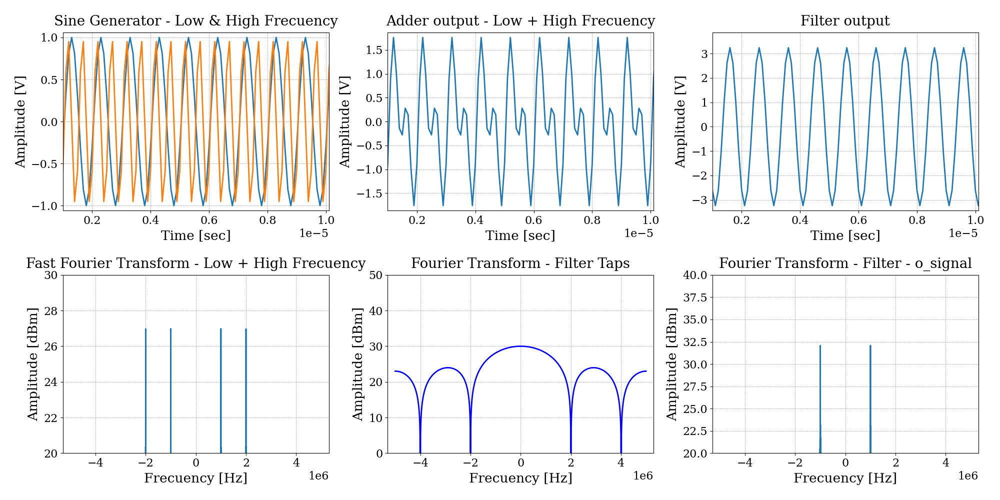

## Low Pass Filter Simulator

Para el presente texto, se muestra la simulación de un filtro pasa bajos. En la grafica a continuación, se pueden apreciar los tonos a sumar en el bloque `u_adder`: la señal de baja frecuencia `u_sin_low` y la señal de alta frecuencia `u_sin_high`. El objetivo de este ejemplo es comprender cómo variar éstas señales y así obtener las gráficas que se requieran. 

{width=60%}

## Pruebas
Se consideran dos casos particulares, uno en el que una de las señales es eliminada y otro en que las señales persisten a la salida del filtro.

### Primer prueba
Para comenzar, se opta por presentar el caso en que una de las señales es eliminada. Por lo que se muestra en cómo setear los parámetros de dichas señales, cómo obtener sus valores para luego procesarlas (loguear) y, por último, levantar las señales en una gráfica para comprobar el funcionamiento del simulador.

#### Configuración de parámetros
En primer lugar, se debe configurar el archivo `{EXAMPLES}/low_pass_filter_sim/conf/settings.yaml`, lo se realiza directamente desde el archivo `{EXAMPLES}/low_pass_filter_sim/main.py`.

```python
simh.update_settings_section()

# @ AUTO_SETTINGS_BEGIN

simh.settings['root']['enable_log'] = 1
simh.settings['root']['fs_clk'] = 10000000.0
simh.settings['root']['logger_buffer_size'] = 1000
simh.settings['root']['n_iterations'] = 10000

simh.settings['root']['u_filter']['coeffs'] = [1, 1, 1, 1, 1]

simh.settings['root']['u_sin_high']['amplitude_v'] = 1
simh.settings['root']['u_sin_high']['frequency_hz'] = 2000000.0
simh.settings['root']['u_sin_high']['phase_deg'] = 0

simh.settings['root']['u_sin_low']['amplitude_v'] = 1
simh.settings['root']['u_sin_low']['frequency_hz'] = 1000000.0
simh.settings['root']['u_sin_low']['phase_deg'] = 0

# @ AUTO_SETTINGS_END

simh.save_settings_yaml()
```

Como se ve, el valor elegido para el tono de baja frecuencia es `frequency_hz: 1e6` y el del tono de alta frecuencia es `frequency_hz: 2e6`. Los coeficientes del filtro son `taps: [1, 1, 1, 1, 1]` y la frecuencia de reloj elegida es `frequency: 10e6`. Cabe aclarar que los valores de frecuencia se encuentran expresados en [Hz].

#### Logueo de señales
En segunda instancia, se debe elegir las señales que se deseen guardar sus valores en archivos de texto, para luego poder realizar gráficas de ellas. Esto se realiza también en el archivo `main.py`, mencionado anteriormente, lo que queda en el archivo `{EXAMPLES}/low_pass_filter_sim/conf/command.cmd`. Entonces, en el archivo de python tenemos:

```python
if args.run:
    simh.clean_command_file()
    

    log_signals = [
        # Clock
        "root.clk",

        # Adder
        "root.u_adder.o_sum",

        # Filter
        "root.u_filter.o_signal",
        "root.u_filter.o_shift_reg",

        # Sine generator low frequency
        "root.u_sin_low.o_sin",

        # Sine generator high frequency
        "root.u_sin_high.o_sin"
    ]

    simh.add_log(signals = log_signals, 
                 clock = "root.clk", 
                 edge = simh.POSITIVE,
                 begin = 0, step = 1, end = 0, 
                 file_type = simh.TEXT,
                 file_name_type = simh.LONG)

    log_signals = [
        # Clock
        "root.clk.i_frequency_hz",

        # Serial Filter
        "root.u_filter.coeffs",
    ]

    simh.add_log(signals = log_signals, 
                 clock = "root.clk", 
                 edge = simh.POSITIVE,
                 begin = 0, step = 1, end = 1, 
                 file_type = simh.TEXT,
                 file_name_type = simh.LONG)
```

Entonces, se loguean las siguientes señales: el reloj (`root.clk`), la salida del sumador (`root.u_adder.o_sum`), las señales del filtro (`root.u_filter.o_signal` y `root.u_filter.o_shift_reg`) y tanto el tono de baja como de alta frecuencia (`root.u_sin_low.o_sin` y `root.u_sin_high.o_sin`). Como se nota, esto se loguea durante toda la simulación, al colocar en la función `add_log` los parámetros siguientes:
```python
begin = 0, step = 1, end = 0
```
Esto indica que comienza a loguear desde el principio de la simulación, con un paso de 1, y al colocar `end = 0` se loguea hasta el final.
Las señales de la frecuencia del clock (`root.clk.i_frequency_hz`) y los coeficientes del filtro (`root.u_filter.coeffs`) se loguean para obtener únicamente una muestra, ya que los valores se mantienen constantes durante toda la simulación.

#### Grafico de señales
Una vez logueadas las señales se procede a mostrar la gráfica de los valores de interés. Sólo se explica el sub-gráfico de ambos tonos en función del tiempo, ya que el procedimiento es similar en cada uno de los sub-gráficos realizados.

```python
#######################################
# FIGURE SETTINGS
#######################################

fig = plt.figure(figsize=(20, 10))
gs = GridSpec(2, 3)

ax1 = fig.add_subplot(gs[0,  0])
ax2 = fig.add_subplot(gs[0,  1])
ax3 = fig.add_subplot(gs[0,  2])
ax4 = fig.add_subplot(gs[1,  0])
ax5 = fig.add_subplot(gs[1,  1])
ax6 = fig.add_subplot(gs[1,  2])

delay = 0
ticks = 10000
phase = 0
x0 = phase + delay
x1 = ticks + phase + delay

###############################################################
#    SIN GENERATOR OUTPUT - LOW & HIGH FRECUENCY (log node)
###############################################################

tit = "Sine Generator - Low & High Frecuency"
fname = tit.replace(" ", "_").lower()
xlab = "Time [sec]"
ylab = "Amplitude [V]"

# Low Frecuency
y_v = data["root.u_sin_low.o_sin"]['s'][x0 : x1]
x_v = data["root.clk"]['s'][x0 : x1]
ax1.plot(x_v, y_v)

# High Frecuency
y_v = data["root.u_sin_high.o_sin"]['s'][x0 : x1]
x_v = data["root.clk"]['s'][x0 : x1]
ax1.plot(x_v, y_v)

ax1.grid(True)
ax1.set_title(f'{tit}')
ax1.set_xlabel(xlab)
ax1.set_ylabel(ylab)
fs = data["root.clk.i_frequency_hz"]['s']
ax1.set_xlim(10/fs,(100+1)/fs)
```

La manera de obtener los valores tanto en tiempo (eje x) como en amplitud (eje y) se realiza de manera similar. Los resultados de la simulación se encuentran en el diccionario `data`, utilizando la key que corresponda. Para conocer el nombre de la key a utilizar, basta con colocar el nombre de la variable logueada en el paso anterior. Luego, se coloca `'s'` para seleccionar los valores logueados de la señal.
El resultado de la simulación fue el siguiente:



Donde se puede ver la eliminación del tono de 2MHz.

### Segunda prueba
Para esta prueba se elige un tono de alta frecuencia de 1,5MHz. Y ya que los coeficientes del filtro no se varían, este tono no se elimina. La única configuración que varía con respecto a la prueba anterior, es la del archivo `setting.yaml`. Esta se muestra a continuación:

```python
simh.update_settings_section()

# @ AUTO_SETTINGS_BEGIN

simh.settings['root']['enable_log'] = 1
simh.settings['root']['fs_clk'] = 10000000.0
simh.settings['root']['logger_buffer_size'] = 1000
simh.settings['root']['n_iterations'] = 10000

simh.settings['root']['u_filter']['coeffs'] = [1, 1, 1, 1, 1]

simh.settings['root']['u_sin_high']['amplitude_v'] = 1
simh.settings['root']['u_sin_high']['frequency_hz'] = 1500000.0
simh.settings['root']['u_sin_high']['phase_deg'] = 0

simh.settings['root']['u_sin_low']['amplitude_v'] = 1
simh.settings['root']['u_sin_low']['frequency_hz'] = 1000000.0
simh.settings['root']['u_sin_low']['phase_deg'] = 0

# @ AUTO_SETTINGS_END

simh.save_settings_yaml()
```

El resto de configuraciones se mantiene de la misma manera, por lo cual se obtienen las siguiente gráfica:
