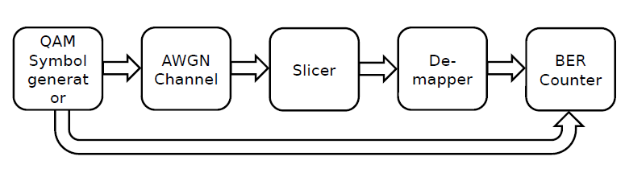
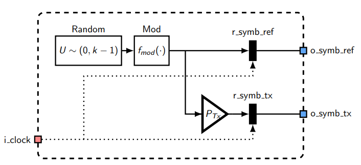
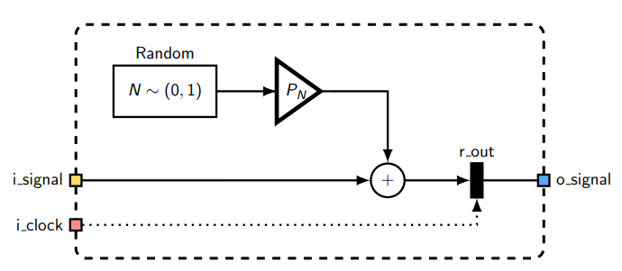
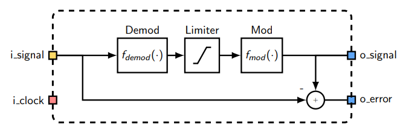
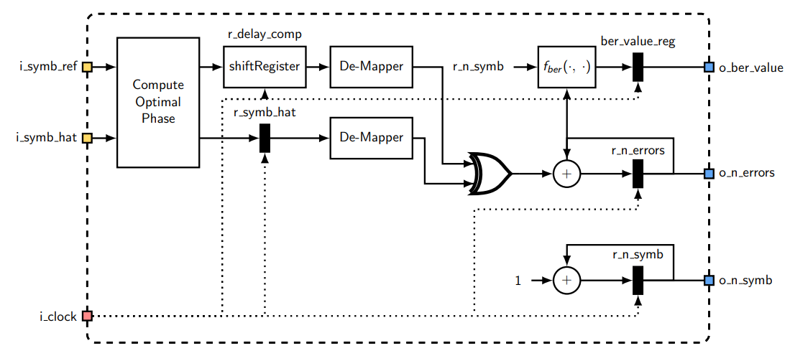
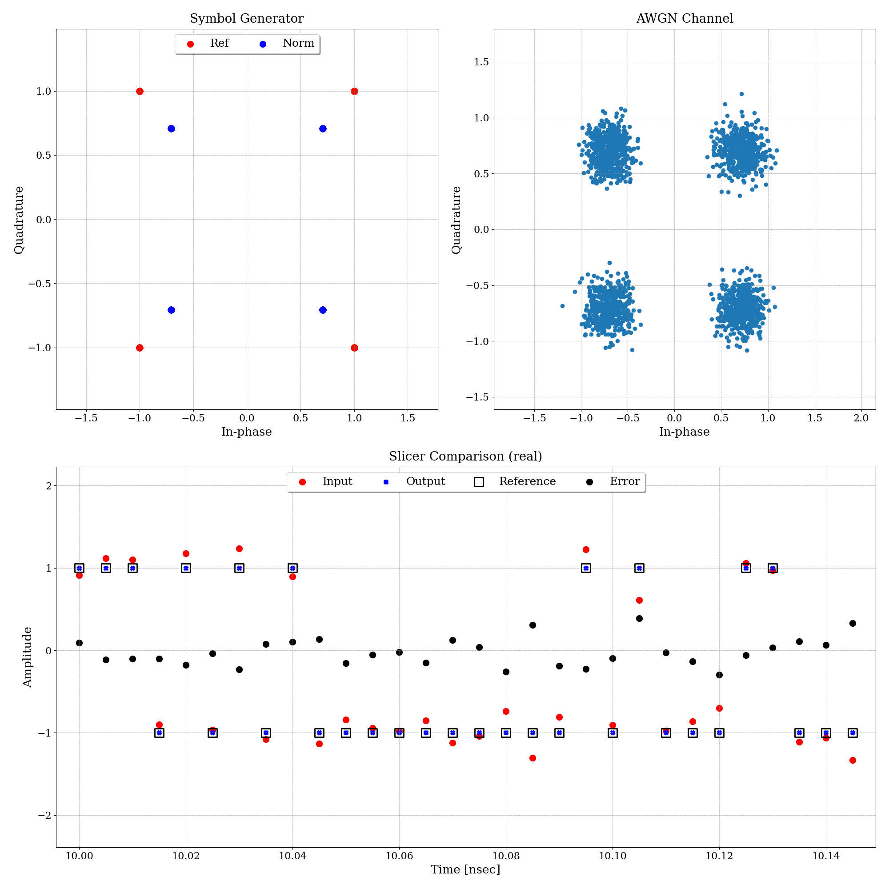
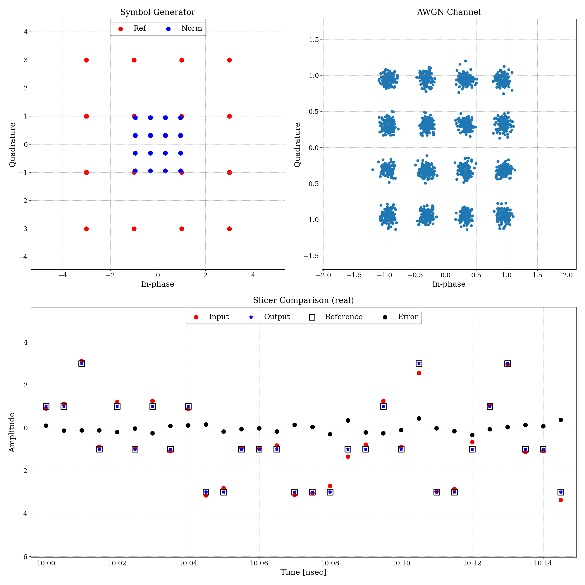
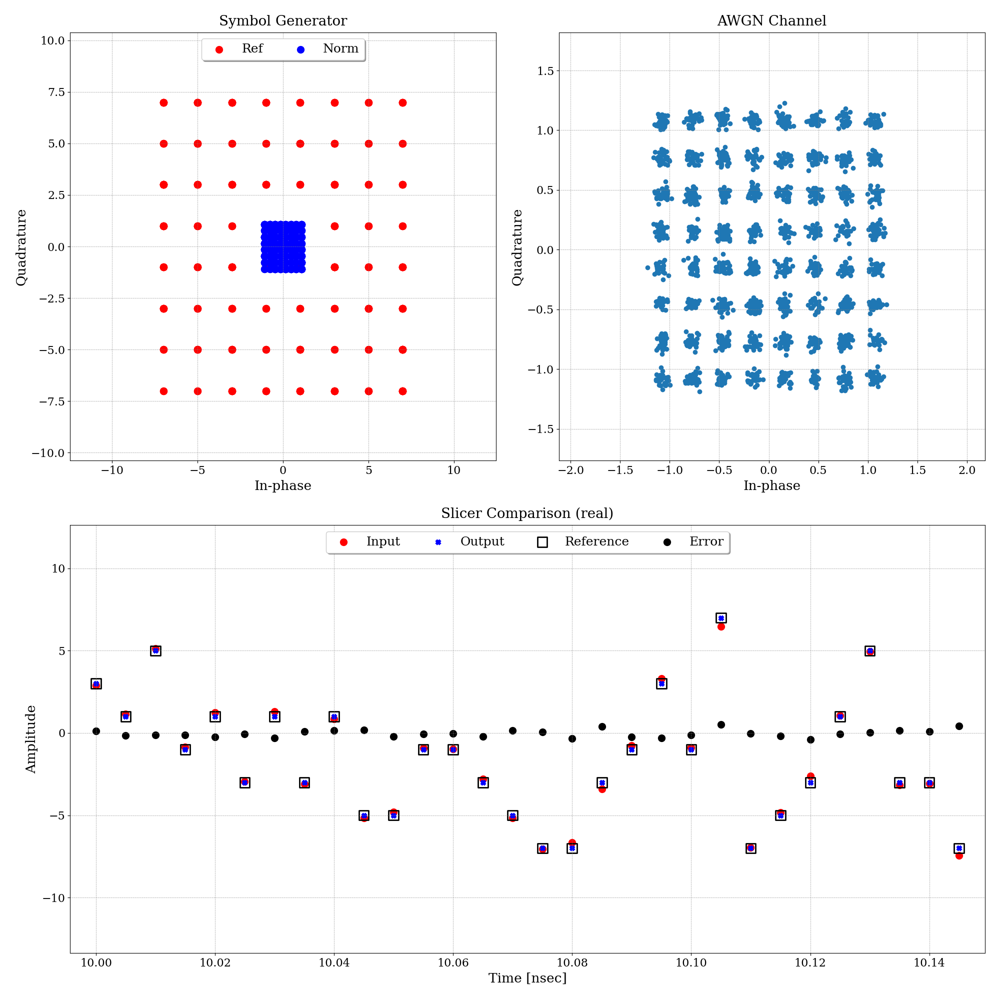

## QAM Basic Simulator

En el presente ejemplo se realiza un simulador básico, el cual cuenta con la siguiente estructura.

{width=80%}

**Notas:** Los siguientes diagramas utilizan la misma nomeclatura utilizada en el simulador, por lo que se observa su equivalencia en código en el correspondiente simulador.

### Symbol Generator
El generador de simbolos es el componente encargado de generar secuencias de símbolos modulados que pueden ser:

* QPSK
* QAM16
* QAM64

Es esencial para emular la forma en que un transmisor real prepara la señal para su transmisión a través de un canal de comunicaciones.

#### Características del modelo de ejemplo:

* El usuario puede seleccionar entre varios esquemas de modulación (los nombrados anteriormente) como también elegir la potencia transmitida.

* Si bien se podria realizar el mapeo de bits a simbolos, en este ejemplo se generan los simbolos directamente.

#### Diagrama del modelo.

{width=80%}

Donde el bloque Random genera una secuencia de números aleatorios de distribución uniforme entre [0, k-1] siendo k la raiz cuadrada del orden de modulación (Mqam = 4, 16, 64).

La función Mod tiene como objetivo tomar estos números aleatorios y formar la constelación, para lo cual una se escala por la potencia a transmitir y la otra salida será utilizada como referencia en el Contador de BER.

### AWGN Channel
Este bloque introduce ruido blanco gaussiano al que lo adiciona a la señal que lo atraviesa. El ruido AWGN es una forma común de ruido que afecta a los sistemas de comunicaciones.

#### Características del modelo de ejemplo:

* Produce ruido con una distribución gaussiana de media cero y varianza Pn (calculada dentro del módulo).
* Los usuarios pueden configurar la potencia del ruido mediante la variación del parámetro EbNo.

#### Diagrama del modelo.


{width=80%}

El generador de números aleatorios produce valores que tienen una distribución normal con media 0 y varianza 1. Estos se escalan para que la potencia sea igual Pn. El resultado es la suma entre la señal que atraviesa el canal y el ruido generado.

### Slicer

El Slicer es un componente del modelo que toma decisiones sobre los simbolos recibidos basandose en una modulación predefinida. Su función es mapear los puntos recibidos en el plano complejo a los puntos más cercanos de la constelación, para recuperar los simbolos originales transmitidos.

#### Características del modelo de ejemplo:

* En base a las muestras de la señal recibida, determina el punto de la constelación más cercano.

* Es capaz de trabajar con diferentes esquemas de modulación (QPSK, QAM16 y QAM64).

#### Diagrama del modelo.

{width=80%}

La función Mod es la misma utilizada en el módulo Symbol Generator, siendo que, como es de esperar, Demod realiza la función inversa, obteniendo una secuencia de números entre [0, k-1] a los cuales se redondea para obtener el simbolo más cercano. La función Limiter solamente limita a aquellos numeros que no estan en el intervalo, es decir, se asegura que la secuencia obtenida este entre [0. k-1].


### BER Counter
Este módulo calcula la tasa de error de bits (BER) que es la proporcion entre bits erroneos y bits transmitidos. Este permite corroborar el funcionamiento del sistema con respecto a la teoria.

#### Características del modelo de ejemplo:

* Compara continuamente los bits de la señal recibida con los bits originales transmitidos.

* El usuario puede activarlo o desactivarlo mediante una variable enable.

#### Diagrama del modelo.


En el diagrama se puede observar el contador de errores y en paralelo se cuentan el número de simbolos transmitidos y el calculo de la BER. La compensación del delay es debido a que, en el proceso de transmisión, la señal inherentemente esta afectada por retrasos, por lo cual se debe compensar el delay en los simbolos de referencia para mantener la coherencia en la comparación. El demapper es una funcion que solamente convierte el simbolo en su equivalencia en bits para realizar la comparacion.

### Resultados

#### Configuración del simulador (QPSK)

```yaml
root:
  u_transmitter:
    u_symbol_gen:
      seed: 0
  u_channel:
    u_awgn_ch:
      seed: 0
      ebno_db: 12
  u_ber_counter:
    corr_signals_size: 100
    enable: 0
  logger_max_buffer_size: 1000
  n_iterations: 100000
  m_qam: 4
  n_ovr: 1
  p_tx: 1
  enable_log: 0
  clk_cmd_handler:
    initial_phase: 0
    frequency_hz: 200e9
  clk:
    initial_phase: 0
    frequency_hz: 200e9
```

#### Plots (QPSK)

{width=80%}

#### Configuración del simulador (QAM16)
```yaml
root:
  ...
  u_channel:
    u_awgn_ch:
      ...
      ebno_db: 15
  ...
  m_qam: 16
  ...
```

#### Plots (QAM16)

{width=80%}

#### Configuración del simulador (QAM64)
```yaml
root:
  ...
  u_channel:
    u_awgn_ch:
      ...
      ebno_db: 18
  ...
  m_qam: 64
  ...
```

#### Plots (QAM64)

{width=80%}