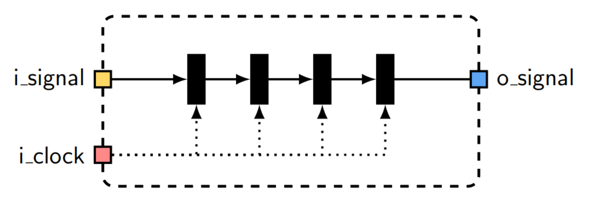
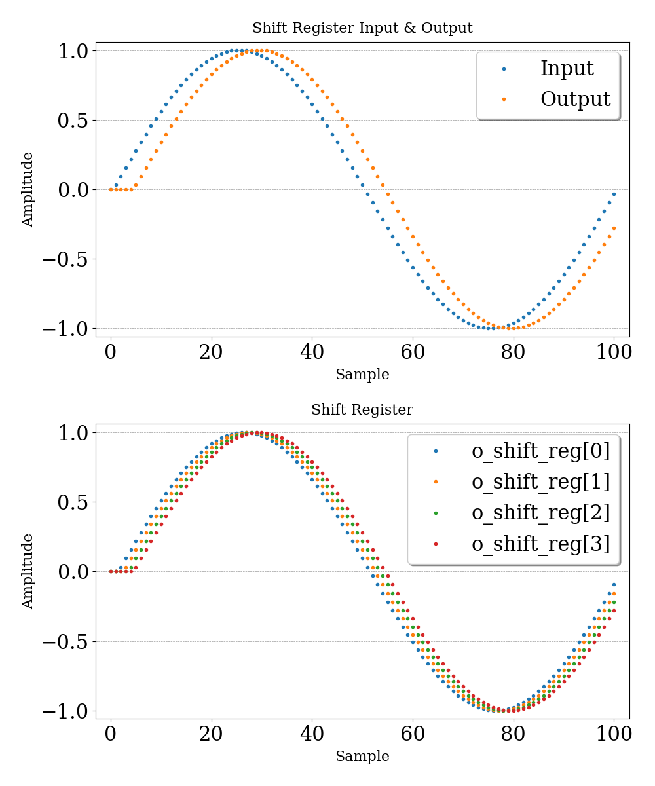
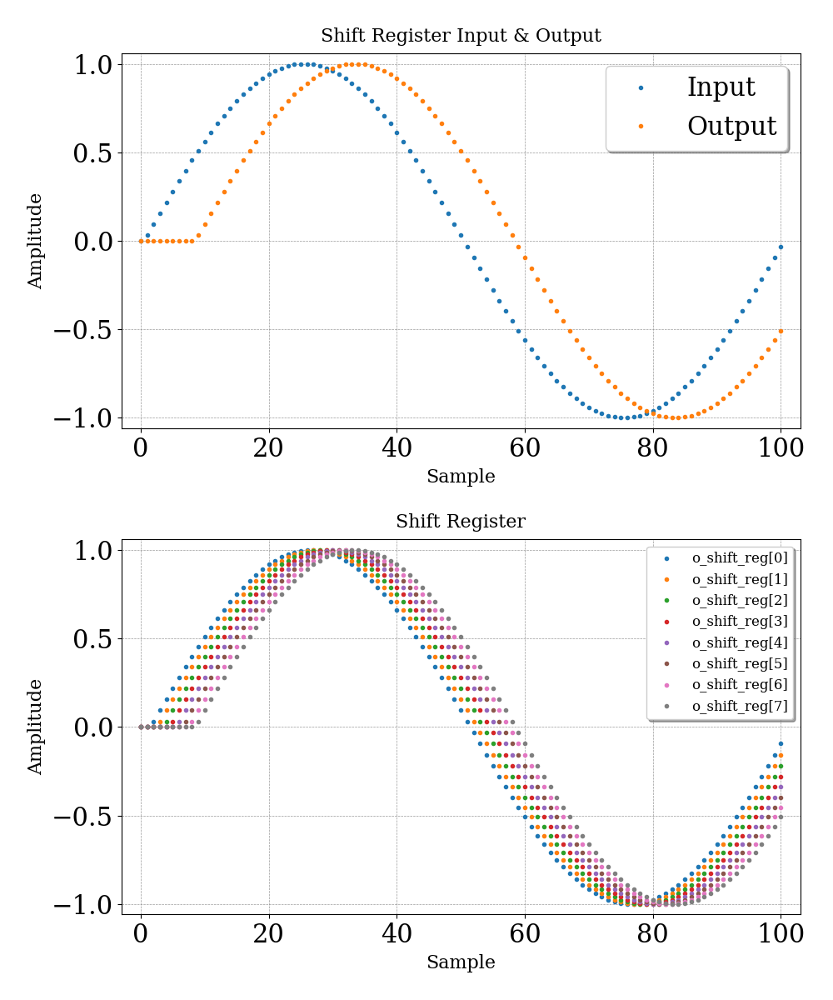

# TP1 - Registro de desplazamiento

## Enunciado

Se solicita diseñar y simular un registro de desplazamiento. El shift register, por su nombre en inglés, debe ser capaz de desplazar sus registros en una dirección determinada y almacenar un nuevo valor en el registro correspondiente.

## Especificaciones

- El shift register estará compuesto por `N` registros.
- Debe tener una entrada para un nuevo valor que se almacenará en el registro más significativo o en el menos significativo, dependiendo de la dirección del desplazamiento.

## Desarrollo
### Conexión módulos
En primer lugar, se muestra un gráfico de cómo se realiza la conexión de los módulos a utilizar.

{width=80%}

Se utiliza un generador de una señal senoidal, con el objetivo de apreciar en la simulación el retraso entre muestras.

### Módulo del registro de desplazamiento
Para plasmar el comportamiento del registro de desplazamiento, se muestra un gráfico que representa el mismo:

{width=80%}

### Resolución para N registros
Ya que se desea tener la posibilidad de cambiar la cantidad de registros `N`, se realiza el módulo `u_shift_reg` con la herramienta templates. Dicho módulo se encuentra en la carpeta `TP1/src/shift_register`.

### Gráficos
Se realizan dos pruebas distintas, donde se varía el valor de registros `N`. A continuación, se presentan los gráficos que poseen los valores de interés. En la parte superior de ellos, se ve tanto el valor de entrada (`root.u_shift_reg.i_signal`) como el de salida (`root.u_shift_reg.o_signal`) de un registro de desplazamiento. Además, se puede ver cada uno de los valores de cada registro (`root.u_shift_reg.o_shift_reg`) en el gráfico inferior.

#### 4 registros 
{width=80%}

#### 8 registros 
{width=80%}
