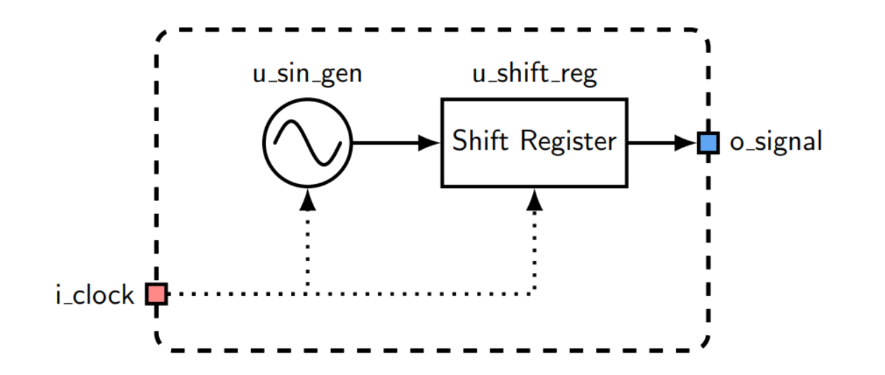
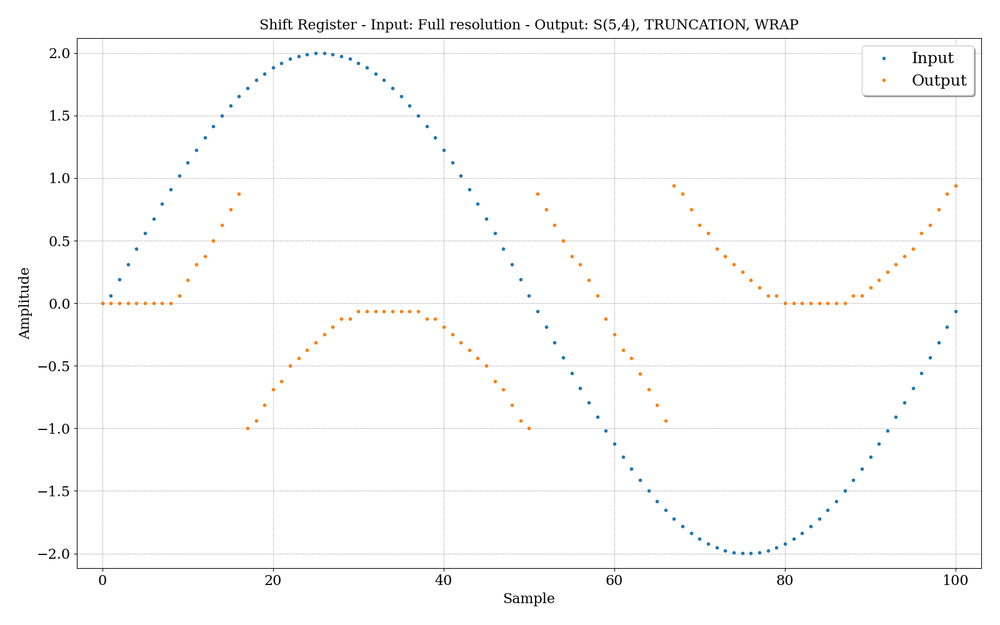
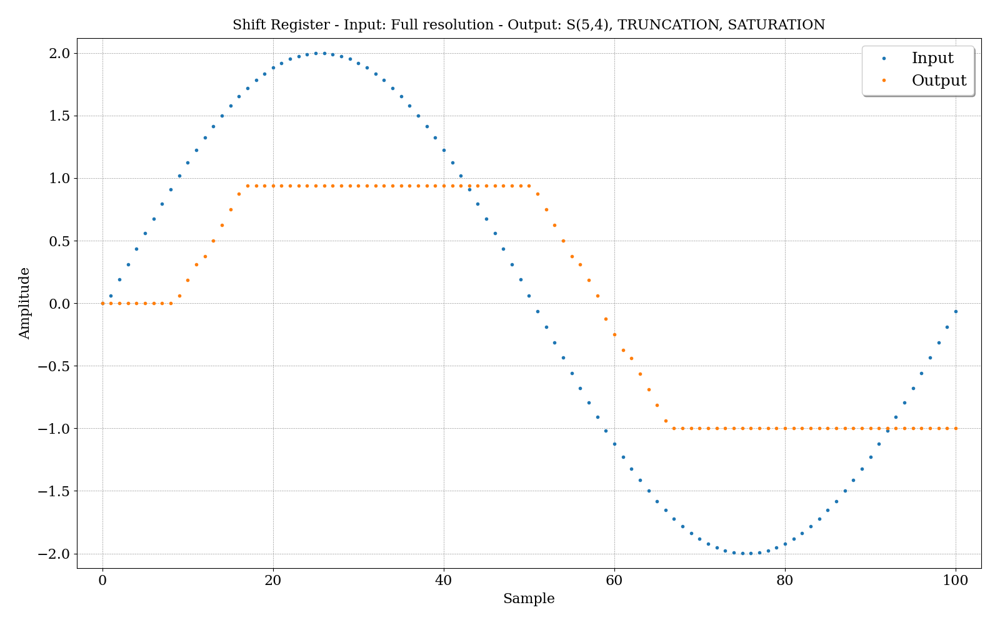
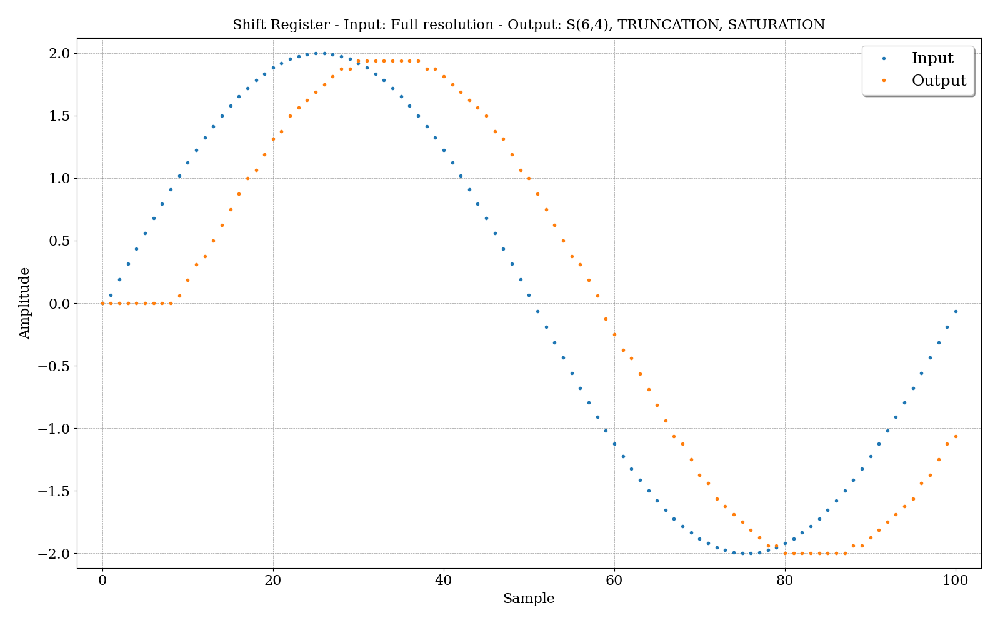
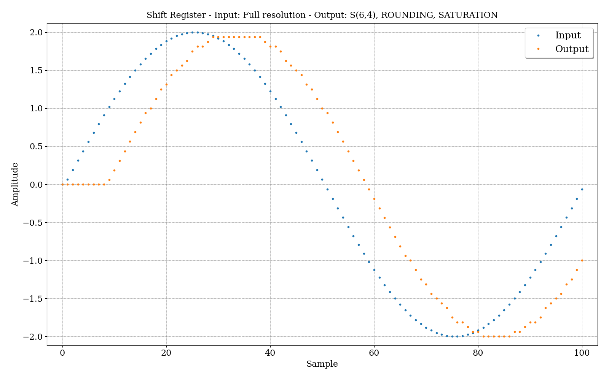

# TP2 - Registro de desplazamiento en punto fijo (Fixed Point)

## Enunciado

Se requiere realizar el diseño y simulación de un registro de desplazamiento, el cual utilice variables de punto fijo.

## Desarrollo
### Conexión módulos
La conexión de los módulos, será la misma que en el trabajo práctico anterior, la cual es la siguiente:

{width=80%}

### Módulo del registro de desplazamiento

El diagrama del modelo para este caso, al igual que en el anterior TP, es:

{width=80%}

### Uso del punto fijo
Para este trabajo, se opta por utilizar variables de punto fijo en el módulo `u_shift_reg`, cuyo funcionamiento se puede ver en el archivo `TP2/src/shift_register`. El objetivo es mostrar varias simulaciones que muestren cómo se modifica la señal de salida, en función de la resolución elegida y el tipo de cuantización y desbordamiento.

### Gráficos
Se muestran gráficos que posean el valor de la señal de entrada, `root.u_shift_reg.i_signal`,y el valor de la señal de salida, `root.u_shift_reg.o_signal`, del registro de desplazamiento.

#### Resolución S(5,4) con truncado y envoltura
Una resolución de S(5,4) se refiere a que se tienen 5 bits en total y 4 bits para la parte fraccional. Ya que la señal senoidal elegida va desde -2 hasta 2, y la cantidad de bits de parte entera es solo 1, sólo se pueden representar valores desde -1 hasta 0.9375. Además, como el tipo de overflow es por envoltura, es decir que se desprecian los bits que no son utilizados, se ve como la señal se vuelve negativa.

{width=80%}

#### Resolución S(5,4) con truncado y saturación
Para este caso, se cambia el tipo de overflow por saturación. Lo que provoca que si se supera el valor máximo o mínimo para la resolución elegida, se elige el mayor o menor valor del rango respectivamente.

{width=80%}

#### Resolución S(6,4) con truncado y saturación
Siguiendo con otra resolución, se aumenta la cantidad de bits enteros a 2, por lo que ahora se pueden representar un mayor rango de valores.

{width=80%}

#### Resolución S(6,4) con redondeo y saturación
Por último, se muestra una pequeña variación con respecto al gráfico anterior. Donde en vez de truncar los valores, es decir descartar los bits menos significativos que quedan fuera del rango, se realiza un redondeo donde se tienen en cuenta dichos bits. 

{width=80%}
