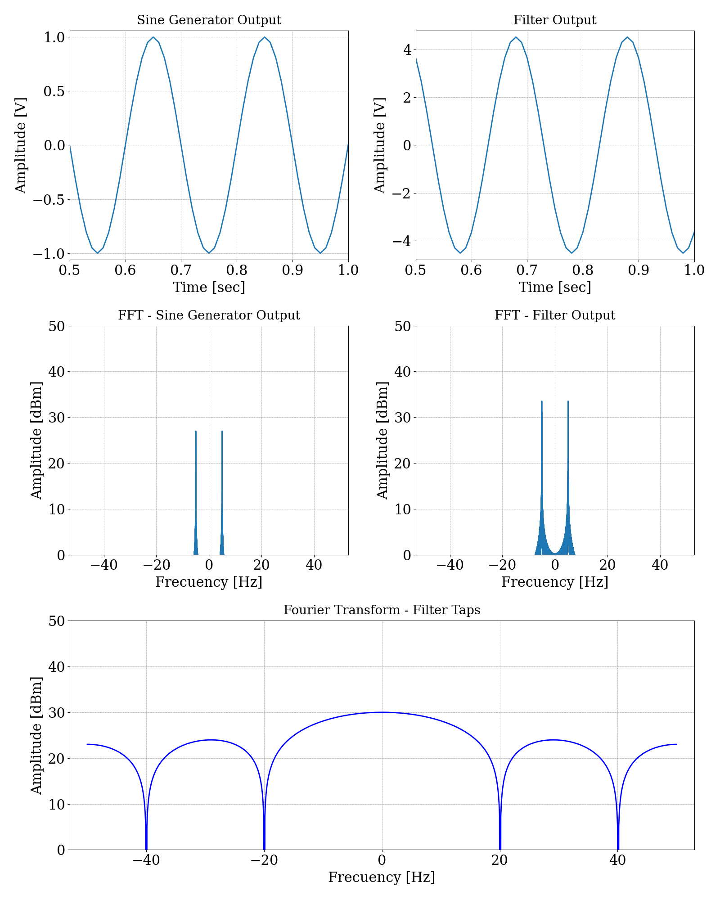
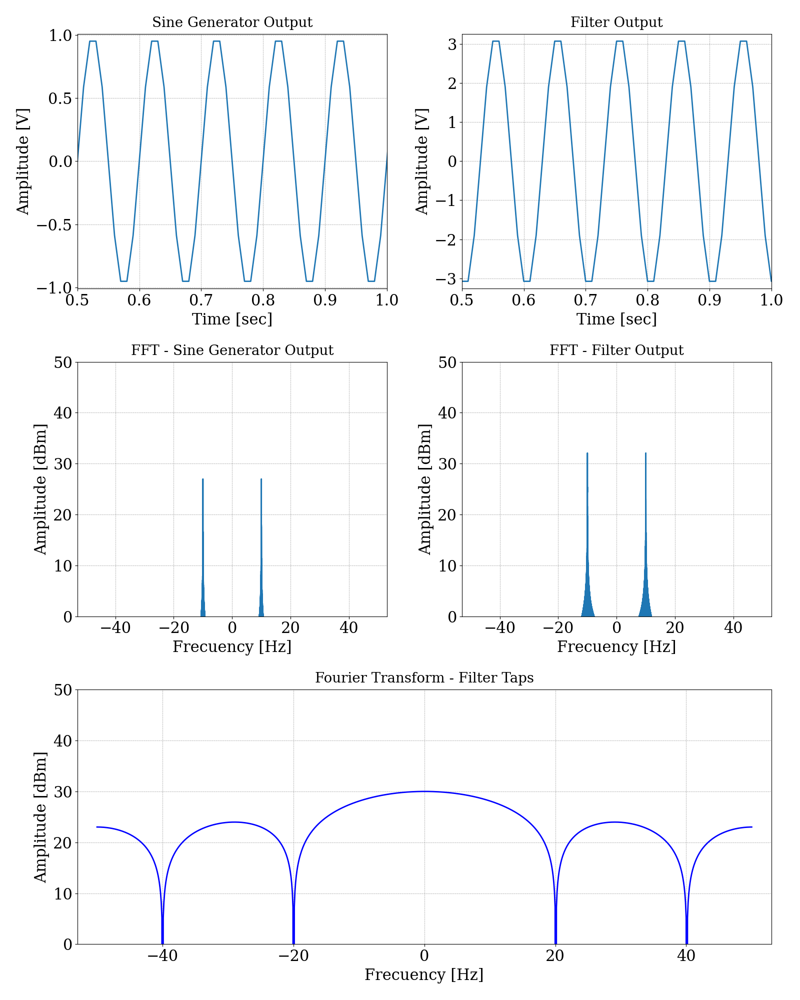
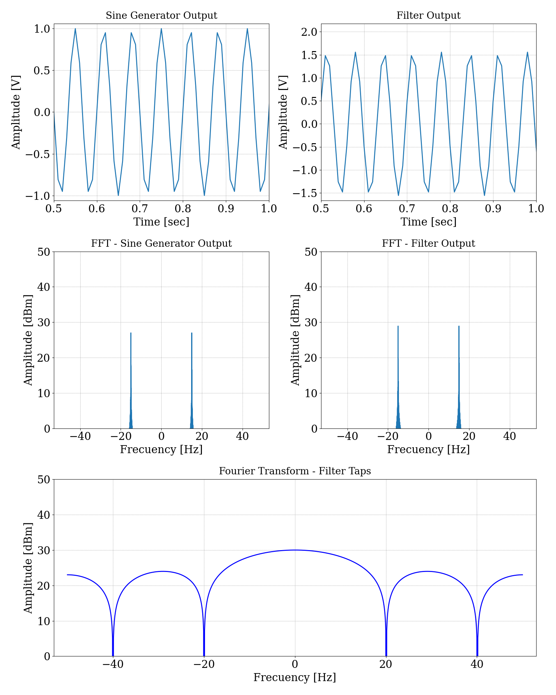
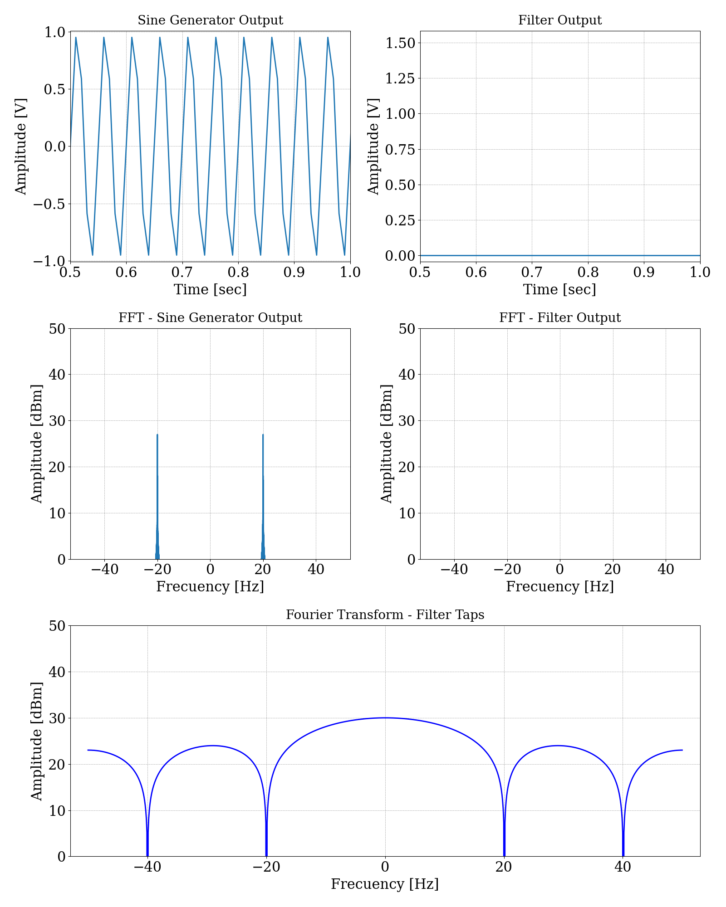

# TP3 - Filtro FIR promediador

## Enunciado

Se solicita diseñar y simular un filtro FIR promediador. El cual se debe probar con una entrada senoidal de distintas frecuencias, que será un módulo a parte del filtro.

## Especificaciones

- Se debe utilizar `5` coeficientes.

## Desarrollo

Se presenta un gráfico de este simulador, para comprender las conexiones de los distintos módulos.

{width=80%}

### Filtro FIR

El filtro FIR (Respuesta al Impulso Finita, por sus siglas en inglés) es un tipo de filtro digital cuya salida está determinada únicamente por un número finito de muestras de la señal de entrada. A diferencia de los filtros IIR (Respuesta al Impulso Infinita), cuya salida depende de un número infinito de muestras, el filtro FIR tiene una respuesta de salida de duración finita.

Un ejemplo común de un filtro FIR es el filtro promediador, utilizado para suavizar una señal eliminando el ruido de alta frecuencia. En un filtro promediador FIR, cada muestra de salida es el promedio de un número finito de muestras de entrada, lo que produce una señal de salida suavizada.

#### Características del modelo de ejemplo:
* Se utilizan `5` coeficientes, lo que requiere un shift register con una cantidad de `5 - 1 = 4` registros.

* Los coeficientes utilizados son: `[1, 1, 1, 1, 1]`.
 

#### Diagrama del modelo.

{width=80%}

### Resultados
Se grafican distintos tonos que difieren en su valor de frecuencia.

#### Frecuencia 5Hz
{width=80%}

#### Frecuencia 10Hz
{width=80%}

#### Frecuencia 15Hz
{width=80%}

#### Frecuencia 20Hz
{width=80%}