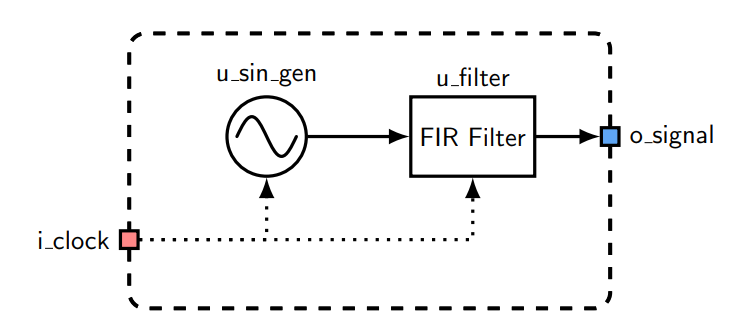
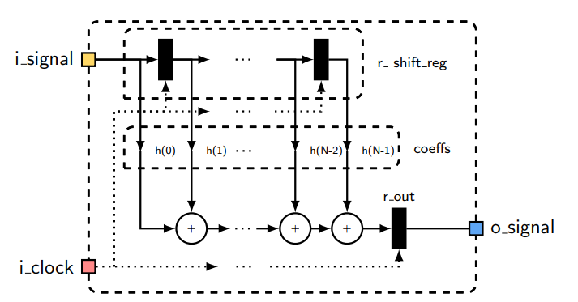
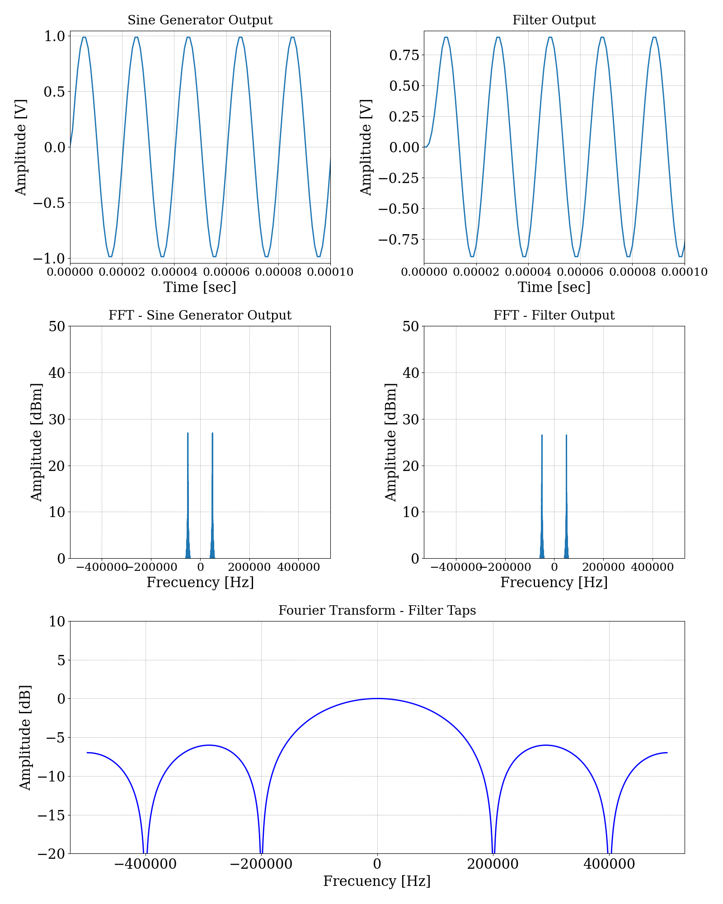
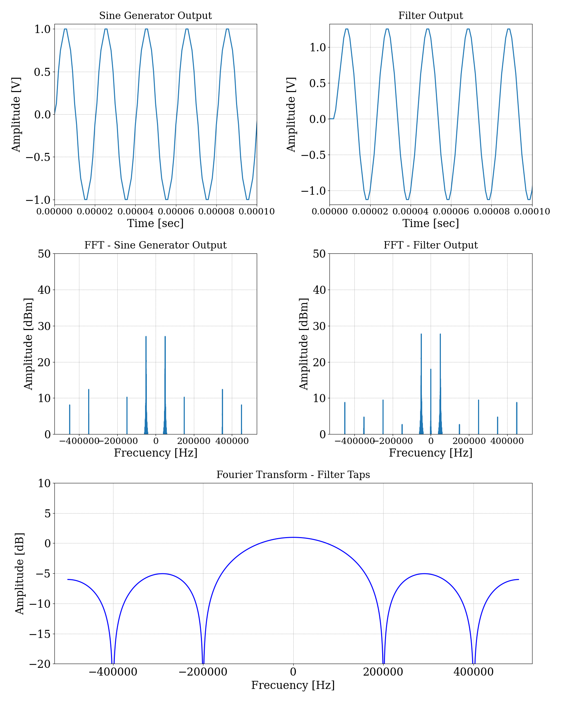
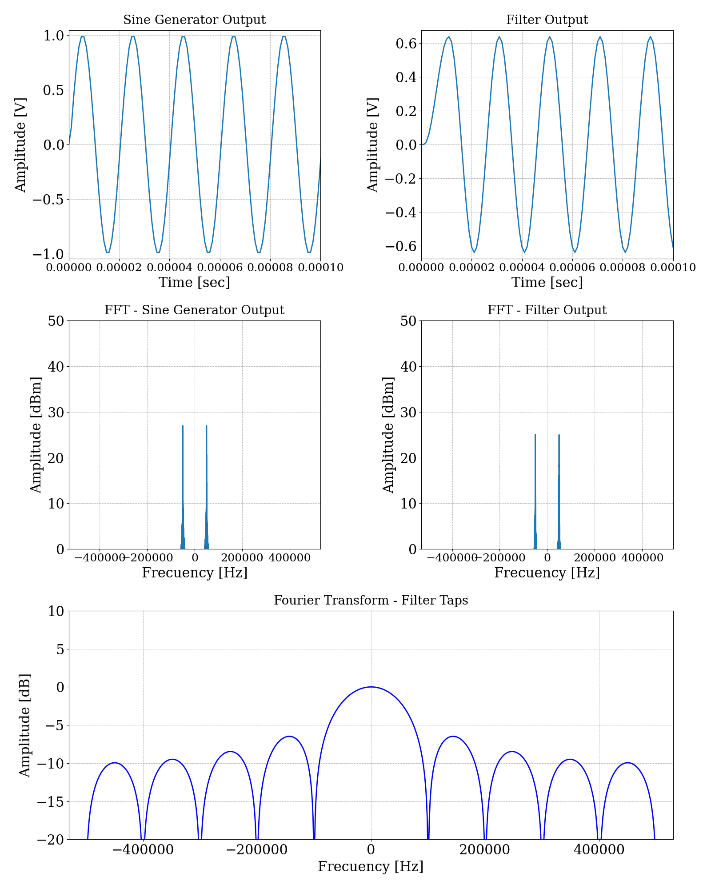
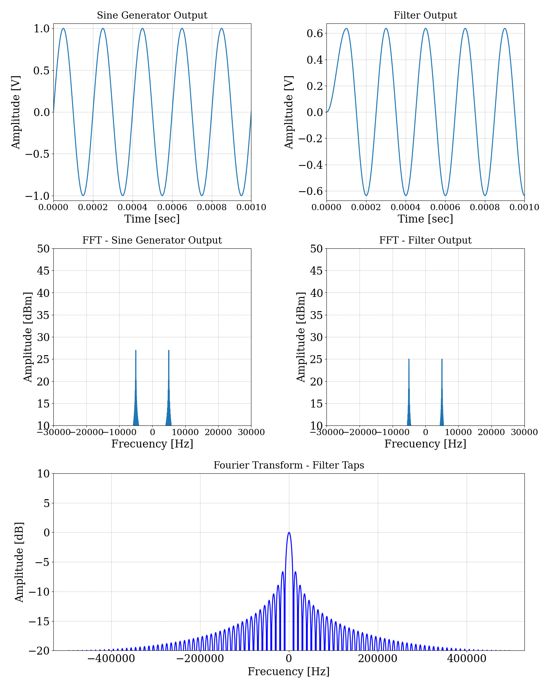

# TP4 - Filtro FIR con templates

## Enunciado

Se solicita diseñar y simular un filtro FIR con templates. Variando la cantidad de coeficientes del filtro, y también el tipo de variable de la entrada senoidal y del filtro.

## Especificaciones

- Se deben utilizar `5`, `10` y `100` coeficientes.
- Dos casos de variables: tipo `double` y `ac_fixed`.

## Desarrollo

Se presenta un gráfico de este simulador, para comprender las conexiones de los distintos módulos.

{width=80%}

#### Características del modelo de ejemplo:
* Se utilizan `N` coeficientes, lo que requiere un registro de desplazamiento con una cantidad de `N - 1` registros.

* Los coeficientes utilizados se eligen en el archivo `main.py`. Si se quiere realizar un filtro promediador, se debe colocar lo siguiente: `N*[1\N]`. Por ejemplo, si la cantidad de coeficientes es 5, quedaría de la siguiente manera:

    `5*[1/5]` que es lo mismo que `[1/5, 1/5, 1/5, 1/5, 1/5]`.
 

#### Diagrama del modelo.

{width=80%}

### Resultados
#### Gráficos para variable de tipo double

#### Número de coeficientes = 5
Variable tipo double:

{width=80%}

Variable tipo ac_fixed<5, 2, true, AC_RND, AC_WRAP>:

{width=80%}

#### Número de coeficientes = 10
{width=80%}

#### Número de coeficientes = 100
{width=80%}
