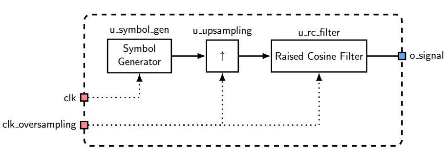
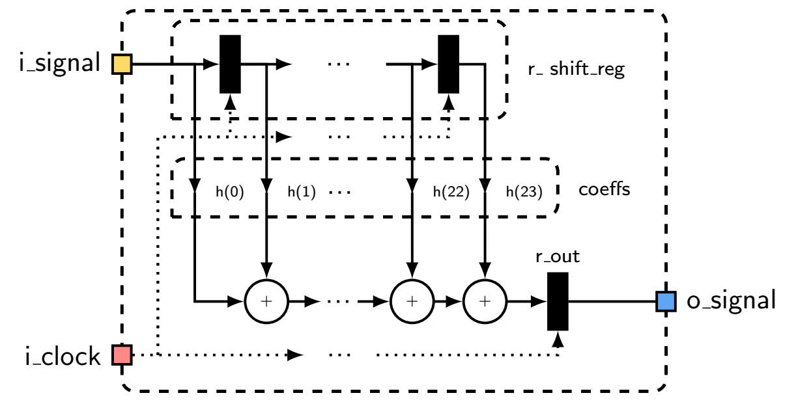
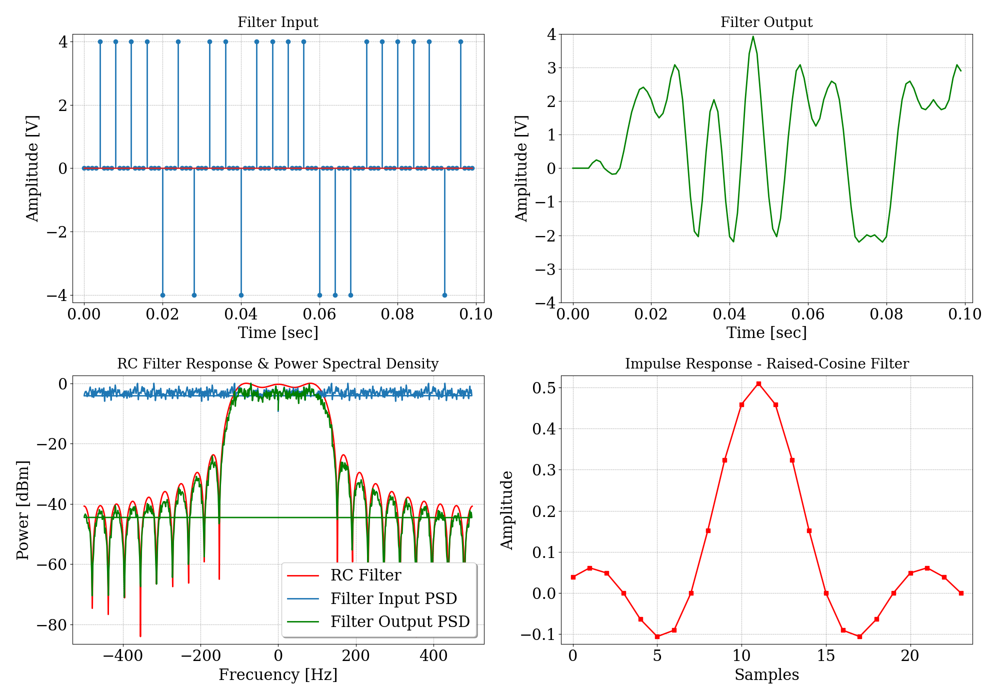
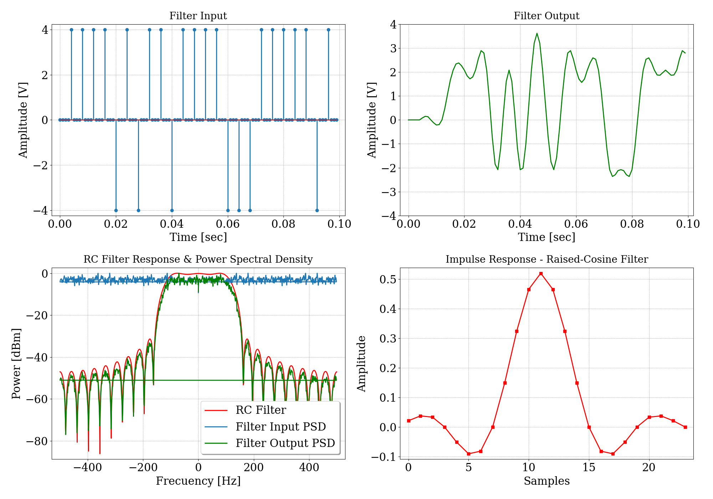
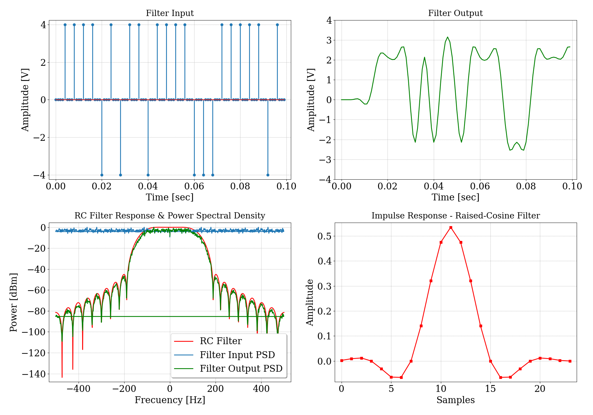
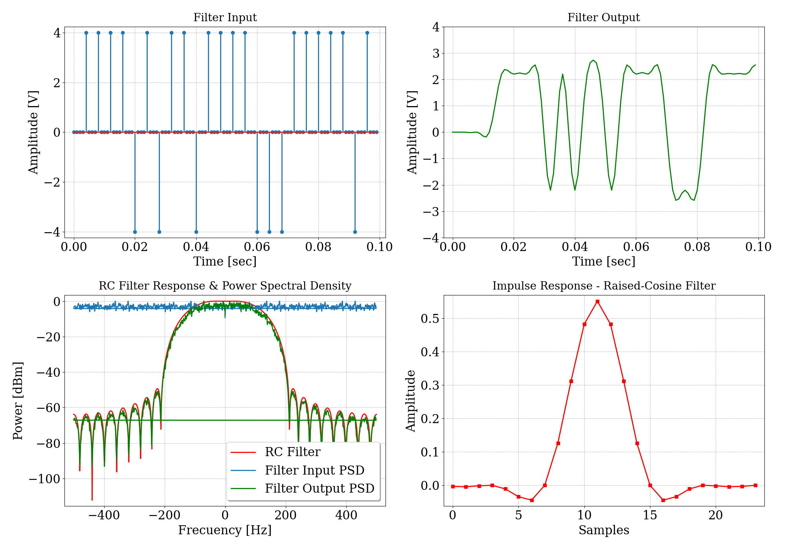

# TP5 - Filtro FIR coseno realzado

## Enunciado

Se solicita diseñar y simular un filtro de coseno realzado. Para realizar las pruebas, se debe utilizar un generador de símbolos, que será un módulo a parte del filtro.

## Especificaciones

- Se debe utilizar de número de Baudios `n_bauds = 6` con un Over Sampling `oversampling = 4` (esto es, valor de coeficientes `NTAPS = 24`).
- Se deben utilizar varios valores de $\beta$ (roll-off). 

## Desarrollo

Se presenta un gráfico de este simulador, para comprender las conexiones de los distintos módulos.

{width=80%}

### Filtro de Coseno Realzado

El filtro de coseno realzado es un tipo de filtro digital diseñado para mejorar ciertas características de una señal, como la reducción de la distorsión y la mejora de la calidad de la señal. Este filtro utiliza una ventana de coseno realzado para aplicar un peso específico a cada muestra de la señal de entrada, mejorando así la respuesta en frecuencia del filtro.

Un filtro de coseno realzado puede ser útil en aplicaciones donde es necesario mantener la integridad de la señal mientras se reduce el ruido y las interferencias. En este tipo de filtro, cada muestra de salida es una combinación ponderada de un número finito de muestras de entrada, determinadas por la ventana de coseno realzado.

#### Características del modelo de ejemplo:
* Se utilizan valores de $\beta$ iguales a `0.1`, `0.3`, `0.5` y `0.7`.
 

#### Diagrama del modelo.

{width=80%}

### Resultados
Se grafican distintos tonos que difieren en su valor de frecuencia.

#### $\beta = 0.1$
{width=80%}

#### $\beta = 0.3$
{width=80%}

#### $\beta = 0.5$
{width=80%}

#### $\beta = 0.7$
{width=80%}
