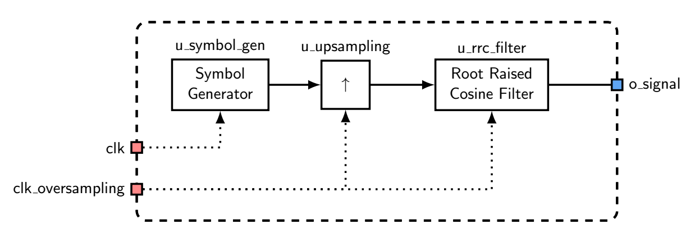
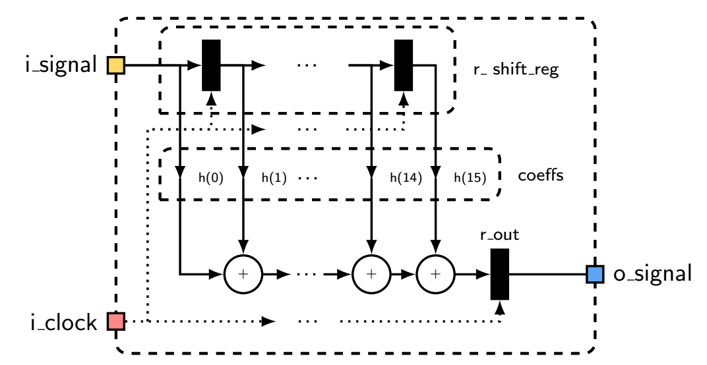
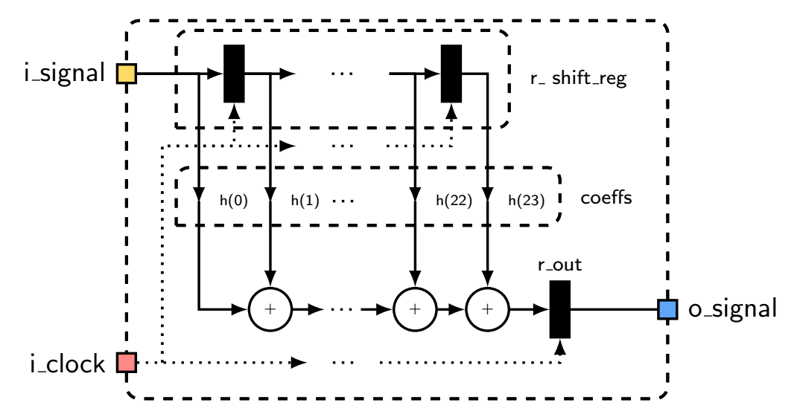
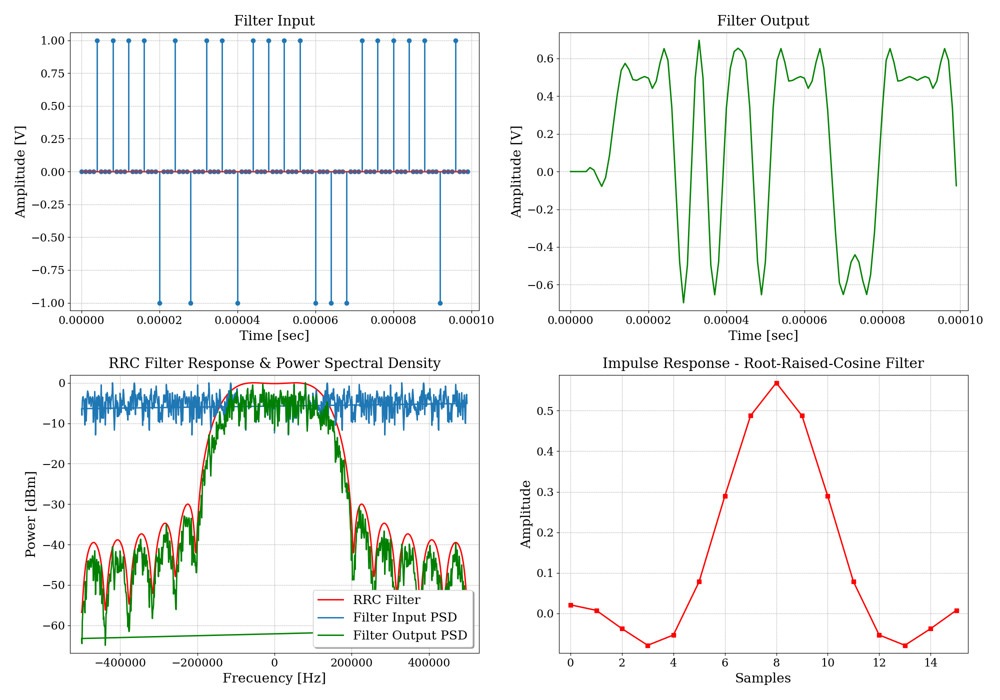
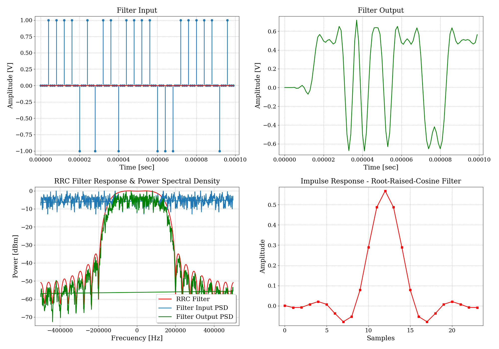
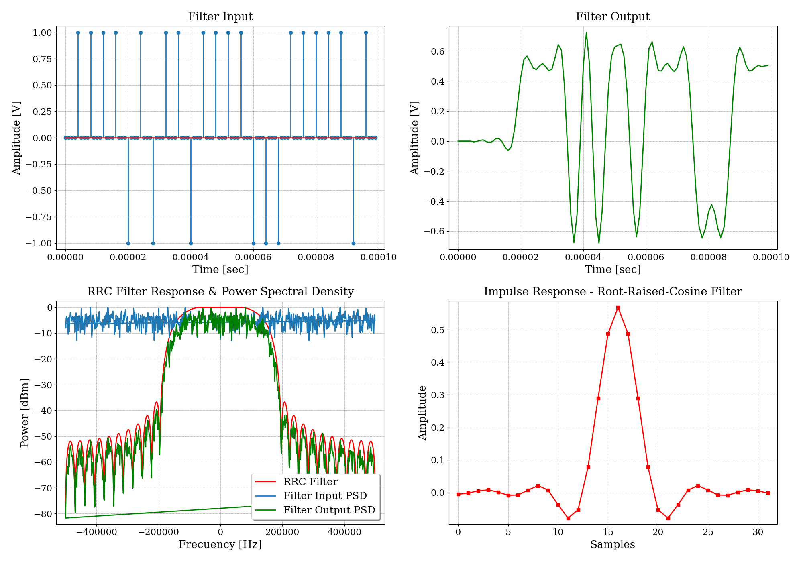
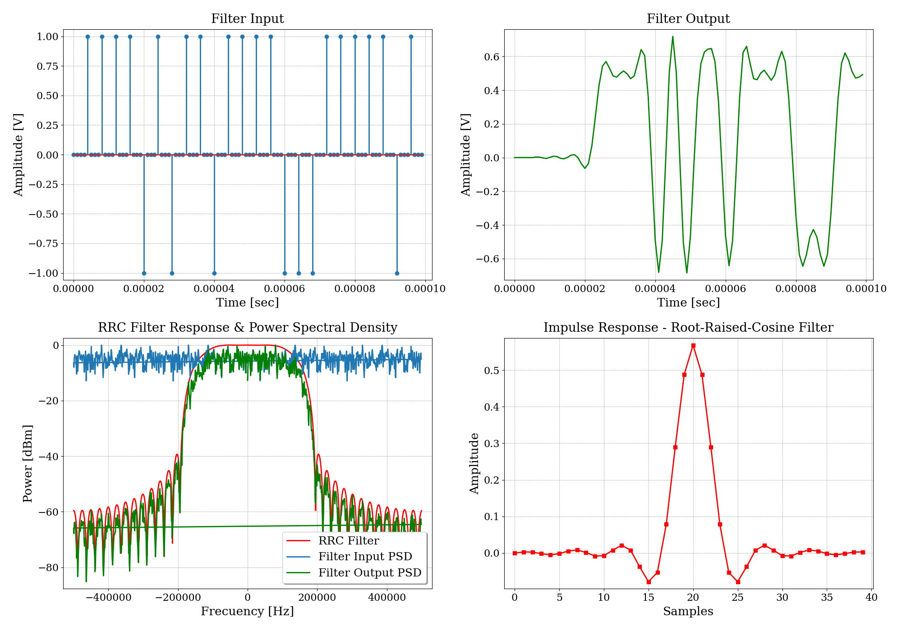

# TP6 - Filtro FIR raiz coseno realzado

## Enunciado

Se solicita diseñar y simular un filtro de raíz de coseno realzado, el cual se debe probar con un generador de símbolos.

## Especificaciones

- Se debe utilizar un roll-off $\beta = 0.5$ con un Over Sampling `oversampling = 4`.
- Se deben utilizar varios números de Baudios `n_bauds`, obteniendo así diferentes valores de coeficientes `NTAPS`.
## Desarrollo

Se presenta un gráfico de este simulador, para comprender las conexiones de los distintos módulos.

{width=80%}

### Filtro de Raíz de Coseno Realzado

El filtro de raíz de coseno realzado es un tipo de filtro digital diseñado para mejorar ciertas características de una señal, como la reducción de la distorsión y la mejora de la calidad de la señal. Este filtro utiliza una ventana de raíz de coseno realzado para aplicar un peso específico a cada muestra de la señal de entrada, mejorando así la respuesta en frecuencia del filtro.

#### Características del modelo de ejemplo:
* Se utilizan valores de `n_bauds` iguales a `4`, `6`, `8` y `10`.
 

#### Diagrama de los modelos

n_bauds = 4:

{width=80%}

n_bauds = 6:

{width=80%}

n_bauds = 8:

{width=80%}

n_bauds = 10:

{width=80%}

### Resultados
Se grafican distintos tonos que difieren en su valor de frecuencia.

#### n_bauds = 4
{width=80%}

#### n_bauds = 6
{width=80%}

#### n_bauds = 8
{width=80%}

#### n_bauds = 10
{width=80%}

