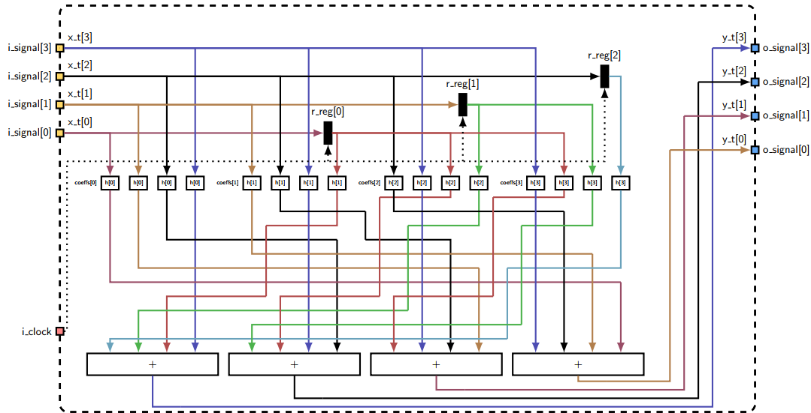

# TP7 - Filtro FIR Paralelo

## Enunciado

Se solicita diseñar y simular un filtro FIR paralelo, utilizando los módulos `serial_to_parallel` y `parallel_to_serial`.

## Especificaciones

- Se debe utilizar un número de taps `NTAPS = 4` específico para cada filtro FIR.
- Se tiene que usar un paralelismo `Parallelism = 4`.

## Desarrollo
A continuación, se muestran las conexiones de los módulos para este trabajo.

{width=80%}

### Filtro FIR Paralelo

El filtro FIR paralelo es un tipo de filtro digital que utiliza múltiples filtros FIR en paralelo para procesar la señal de entrada. Este enfoque puede mejorar ciertas características de la señal, como la reducción de la distorsión y la mejora de la calidad de la señal. Cada filtro FIR en el conjunto paralelo puede tener diferentes coeficientes para aplicar un procesamiento específico a la señal de entrada.

#### Características del modelo de ejemplo:
En este caso, el objetivo de este filtro es realizar un filtrado de la señal de entrada, teniendo en cuenta que el módulo `u_ser_to_par` trabaja a una frecuencia de clock 4 veces la frecuencia del generador de símbolos, esto es `clk_fast = 4 * clk_slow`. Y ya que el paralelismo es también igual a 4, se obtienen por cada ciclo del reloj `clk_slow` 4 muestras de la señal de entrada: $x_t[0]$, $x_t[1]$, $x_t[2]$ y $x_t[3]$ (es decir, $x[n-0], x[n-1], x[n-2], x[n-3]$). Por lo que se pueden procesar 4 señales de salida, las cuales son: $y_t[0]$, $y_t[1]$, $y_t[2]$ y $y_t[3]$ (es decir, $y[n-0], y[n-1], y[n-2], y[n-3]$). Estas señales ingresan al módulo `u_par_to_ser`, el cual vuelve a obtener la salida en serie, lo que significa que se obtiene una muestra por cada ciclo de reloj `clk_fast` en el siguiente orden: $y_t[3]$ -> $y_t[2]$ -> $y_t[1]$ -> y $y_t[0]$.

#### Diagrama del modelo

Las ecuaciónes para obtener las salidas mencionadas son:

$y\_t[0] = x\_t[0] \cdot coeffs[0] + ~~~~~~~ x\_t[1] \cdot coeffs[1] + ~~~~~~~ x\_t[2] \cdot coeffs[2] + ~~~~~~~ x\_t[3] \cdot coeffs[3]$

$y\_t[1] = x\_t[1] \cdot coeffs[0] + ~~~~~~~ x\_t[2] \cdot coeffs[1] + ~~~~~~~ x\_t[3] \cdot coeffs[2] + r\_reg.o[0] \cdot coeffs[3]$

$y\_t[2] = x\_t[2] \cdot coeffs[0] + ~~~~~~~ x\_t[3] \cdot coeffs[1] + r\_reg.o[0] \cdot coeffs[2] + r\_reg.o[1] \cdot coeffs[3]$

$y\_t[3] = x\_t[3] \cdot coeffs[0] + r\_reg.o[0] \cdot coeffs[1] + r\_reg.o[1] \cdot coeffs[2] + r\_reg.o[2] \cdot coeffs[3]$
 

Y su diagrama es el siguiente:

{width=80%}

### Resultados

{width=80%}

