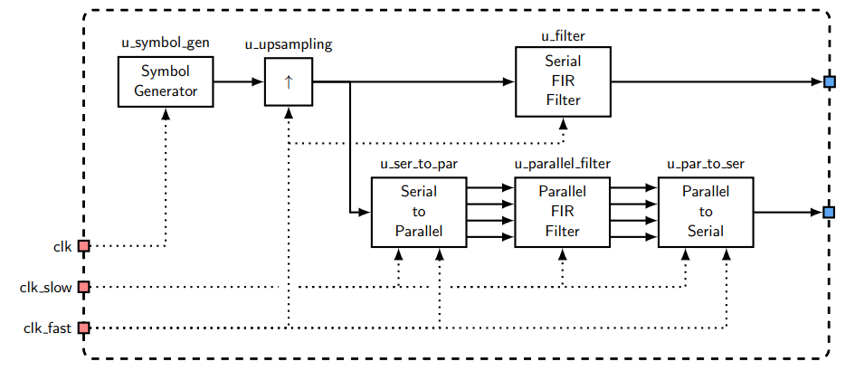
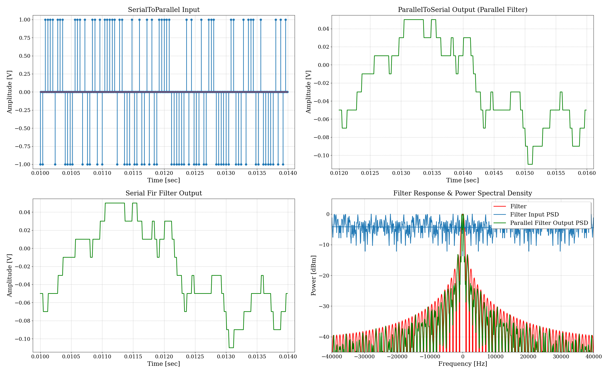

# Extensión del TP7  - Filtro FIR Paralelo

## Enunciado

Se solicita diseñar y simular un filtro FIR paralelo, utilizando los módulos `serial_to_parallel` y `parallel_to_serial`, que sea parametrizable en cantidad de coeficientes. A la vez, se tiene que implementar un filtro serie, también parametrizable, con los mismos coeficientes para comparar resultados.

## Especificaciones

- Se debe utilizar un número de taps `NTAPS` específico para cada filtro FIR.
- Se tiene que usar un paralelismo `Parallelism = NTAPS`.

## Desarrollo
A continuación, se muestran las conexiones de los módulos para este trabajo. Cabe aclarar, que esto es simplemente un ejemplo para poder mostrar cómo se realiza un filtro FIR paralelo parametrizable y lograr una comparación con un filtro FIR serie. No es un módulo que se quiera llevar a la práctica.

{width=80%}

#### Características del modelo de ejemplo:
En este caso, se opta por utilizar una cantidad de `NTAPS = 100`, por lo que la relación entre los clocks de los módulos `u_ser_to_par` y `u_par_to_ser` es `clk_fast = 100 * clk_slow`. El clock restante, `clk`, se utiliza a una frecuencia de baudio, y ya que el oversampling del `u_upsampling` es igual a 4, se tiene `clk_fast = 4 * clk`.

### Resultados

{width=80%}

