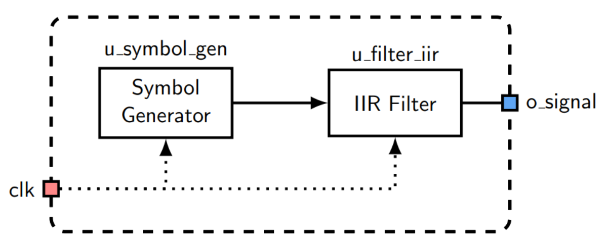
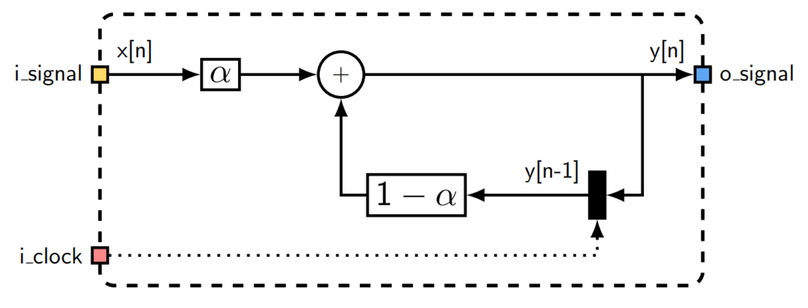
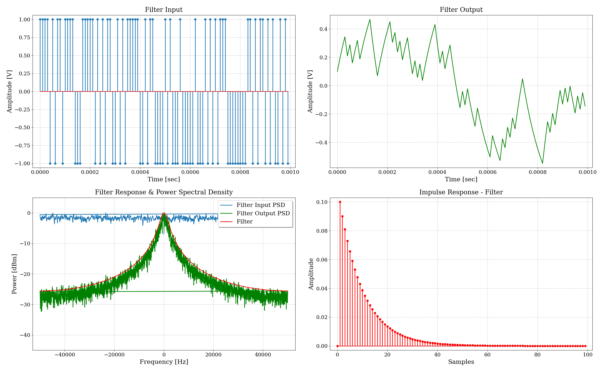
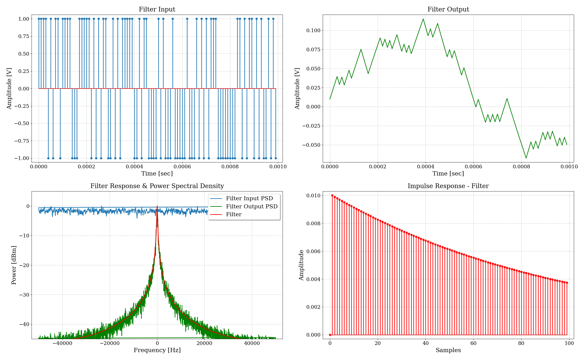

# TP8 - Filtro IIR

## Enunciado

Se requiere el diseño y simulación de un filtro IIR.

## Especificaciones

- La ecuación que define el filtro IIR es:
    - $y[n] = \alpha \cdot x[n] + (1-\alpha) \cdot y[n-1]$
- Se deben usar dos valores diferentes de $\alpha$.

## Desarrollo
A continuación, se muestran las conexiones de los módulos utilizados en este trabajo.

{width=80%}

### Filtro IIR

El filtro IIR es un filtro digital que emplea retroalimentación para procesar la señal de entrada. Los filtros IIR se caracterizan por tener una respuesta en frecuencia infinita debido a la retroalimentación, lo que los diferencia de los filtros FIR.

#### Características del modelo de ejemplo:
Se usan los siguientes valores de $\alpha$:
- $\alpha = 0.1$
- $\alpha = 0.01$

#### Diagrama del modelo

El diagrama es el siguiente:

{width=80%}

### Resultados
#### $\alpha = 0.1$
{width=80%}

#### $\alpha = 0.01$
{width=80%}

En conclusión, a medida que se reduce el valor de $\alpha$, la frecuencia de corte del filtro disminuye y el tiempo de establecimiento del sistema aumenta.
