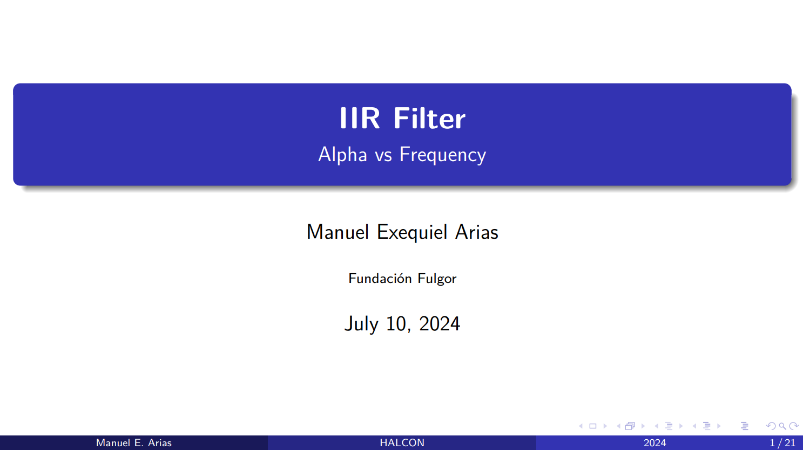
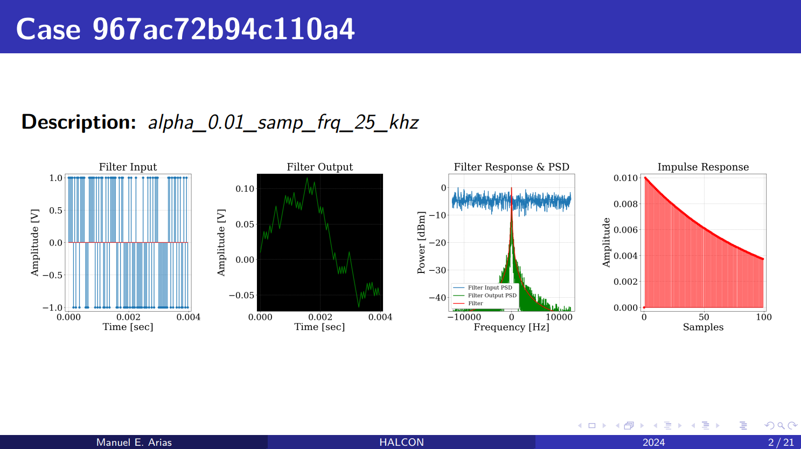
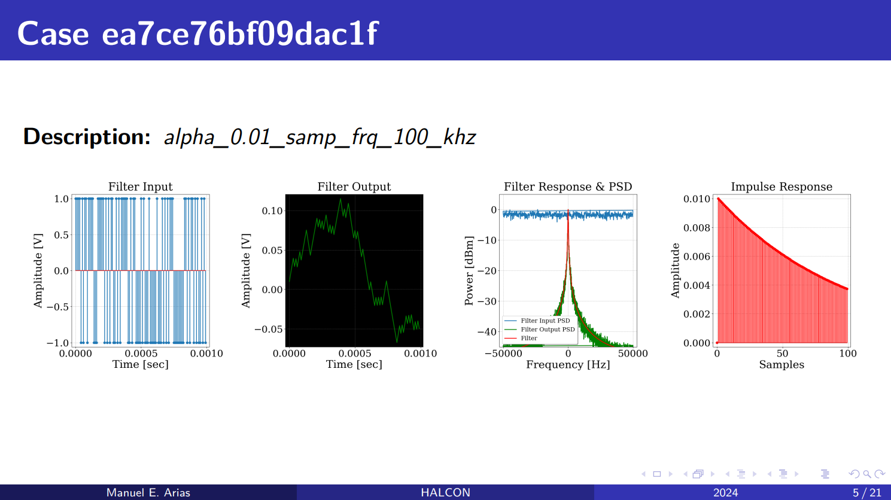
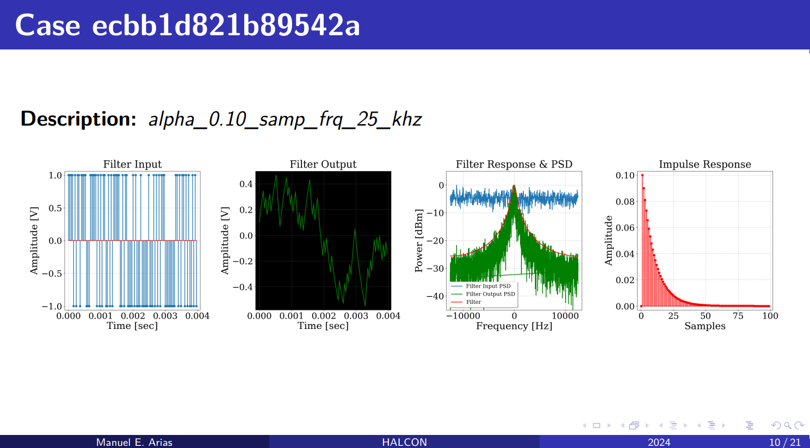
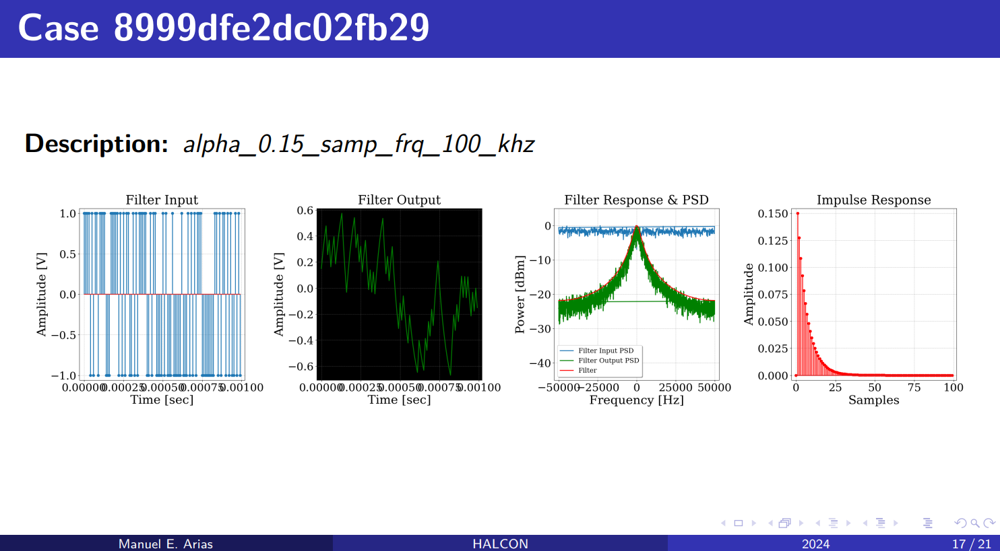
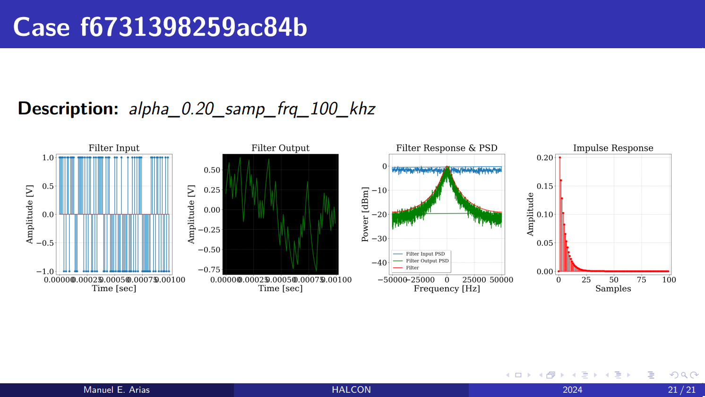

# TP9 - Filtro IIR con barrido de parámetros

## Enunciado

Utilizando el TP8, realizar un barrido de parámetros para distintos valores de configuración.

## Especificaciones

- Variar el valor de $\alpha$ contra frecuencia de clock, siendo  
- Valores de $\alpha$:
    - 0.01, 0.05, 0.10, 0.15, 0.20.
- Valores de frecuencia de clock:
    - 25kHz, 50kHz, 75kHz, 100kHz.

## Desarrollo
Se muestra a continuación, los pasos a seguir para realizar un barrido de parámetros.

En primer lugar, el archivo que realiza el barrido se encuentra en:

```bash
{TUTORIALS}/tp9/tests/alpha_vs_freq/sweep.py
```

Este archivo es muy similiar al llamado `main.py` de cada simulador, pero con algunas diferencias que se comentarán en los siguientes subincisos. Ahora, se listan las banderas que pueden ser utilizadas en dicho archivo. Para ello, podemos colocar el comando `./sweep.py -h` en la carpeta nombrada anteriormente. La consola devuelve:

```bash
usage: sweep.py [-h] [-d] [-f] [-p] [-l] [-r] [-t] [-R] [-M] [-A] [-K] [-S] [-F] [-L] [-D] [-P] [-T]

optional arguments:
  -h, --help          show this help message and exit
  -d, --delete        delete old compilation files and logs
  -f, --compile_f     compile in FULL version
  -p, --compile_p     compile in POSEDGE version
  -l, --enable_logs   enable compilation logs
  -r, --run_sim       run simulator
  -t, --run_tests     run simulator tests
  -R, --run_cases     run all cases
  -M, --run_missing   run missing cases
  -A, --run_again     run all again
  -K, --kill          kill running cases
  -S, --summary       test summary
  -F, --folders_list  case folders list
  -L, --live          live_summary
  -D, --delete_test   delete test folder
  -P, --processing    run processing scripts
  -T, --latex         export latex
```

Se logra apreciar que siguen estando las mismas banderas que para el `main.py`, las cuales son todas minúsculas, y se agregan banderas en mayúsculas para realizar el barrido:
- `-R | --run_cases`: remueve la carpeta actual del test si existe, crea el árbol de directorios para el test y corre todos los casos.
- `-M | --run_missing`: usa el test existente y corre de nuevo los casos que fueron clonados pero no finalizados.
- `-A | --run_again`: usa el test existente y corre de nuevo todos los casos.
- `-K | --kill`: mata los casos que se estén corriendo.
- `-S | --summary`: muestra un resumen de los casos del test, donde se ve tanto la cantidad de casos, como el ID, tiempo requerido, nombre y descripción de cada uno.
- `-F | --folders_list`: lista los casos y la carpeta donde se encuentra cada uno.
- `-L | --live`: hace un resumen que se va actualizando en vivo.
- `-D | --delete_test`: borra la carpeta del test.
- `-P | --processing`: corre el script para procesar el test. Que es donde se realizan los plots de cada caso.
- `-T | --latex`: exporta un archivo de latex, que al compilarlo resulta en filminas que posee cada uno de los casos. Cabe aclarar que para que funcione, se debe utilizar esta bandera con la bandera anterior (`-P | --processing`).

- Orden de comandos a seguir:
    - `./sweep.py -f`: Para compilar el proyecto.
    - `./sweep.py -R`: Corro los casos. 
    - `./sweep.py -S`: Verifico que hayan terminado. 
    - `./sweep.py -M`: Corro los que falten, si hace falta. 
    - `./sweep.py -P -T`: Realizo los plots y exporto el archivo de latex. 


### Comandos de set y log
En este caso, tenemos el primer TP que se realiza comandos log con tipo de archivo de salida binario. Esto tendrá un pequeño detalle al realizar el plot de los gráficos, lo cual se verá más adelante.

### Parámetros a barrer
En esta sección, se ven los parámetros a barrer y cómo se declaran.
La clase `Parameter` tiene los siguientes atributos:
- `name`: Nombre del parámetro a barrer, utilizando el mismo formato que los comandos de log y set.
- `text`: Patrón de descripción, el cual permite reconocer cada caso. El valor entre llaves (`{}`) permite definir el formato del valor `value`.
- `alpha`: Factor de escala, el cual se le aplica a cada valor `value` para elección del usuario.
- `value`: Valor a barrer, el cual selecciona el valor que se le aplica a `name` en cada caso.
- `simh`: La clase `Parameter` requiere conocer el `SimulatorHandler()`, por ello se le asigna en cada uno de los parámetros.

Para comprender de una mejor manera, se deja como ejemplo el caso utilizado en este TP:
```python
p_sampling_frequency_v = Parameter (
    name = 'root.clk.frequency_hz', 
    text = 'samp_frq_{:.0f}_khz',
    alpha = 1/1e3, 
    value = np.linspace(25e3, 100e3, 4),
    simh = simh
)
```

En este caso, se varía la frecuencia en los parámetros `25e3, 50e3, 75e3 y 100e3`. Respectivamente, cada caso muestra como `text` lo siguiente: `samp_frq_25_khz, samp_frq_50_khz, samp_frq_75_khz, samp_frq_100_khz`.

### Test y casos
Luego, se instancia la prueba o test cuya clase es `Test`, agregando los parámetros listados anteriormente. En el siguiente bloque de código, se ve el lugar donde se guardarán los datos del test (`base_dir`) y se listan los parámetros (`parameters`):
```python
test = Test (
    name = "Parameter Sweep",
    base_dir = "../scratch/",
    parameters = Parameter.list()
)
```
Siguiendo con los casos, se crean uno por uno utilizando tantos bloques de `for` anidados como parámetros a barrer hayan:
```python
for p_alpha in p_alpha_v:
    for p_sampling_frequency in p_sampling_frequency_v:
        
        # Create Case
        case = Case(simh)
                    
        # Add Parameters
        case.add(p_alpha)
        case.add(p_sampling_frequency)

        # Add to Test
        case = test.add(case)
```

Así, se crea cada caso, se agregan el parámetro en cada uno de ellos y se agregan al test.

Finalmente, los casos se guardan utilizando la línea de código:
```python
test.save_cases()
```

### Gráficos
Continuando con el script, tenemos una sección donde se recorre con dos `for` anidados cada uno de los casos. El objetivo de esta parte es realizar cada uno de los gráficos requeridos, y finalmente guardarlo para levantarlo en la siguiente sección, cuando se exporte el archivo de latex. Cada uno de los gráficos se guarda en `{TUTORIALS}/tp9/tests/alpha_vs_freq/img/` con el nombre `sweep_{i}_{j}.png` siendo `i` y `j` las variables que iteran en el for.

### Latex
En esta última sección, se permite configurar distintas partes de las filminas a exportar. Como lo es el título, subtítulo, autor, e institución. También es posible definir el tema y paquete a utilizar.
Para finalizar, se realiza una filmina para cada caso mostrando información relevante de cada uno.

## Resultados
Se muestran algunas de las filminas obtenidas:

{width=80%}

{width=80%}

{width=80%}

{width=80%}

{width=80%}

{width=80%}

